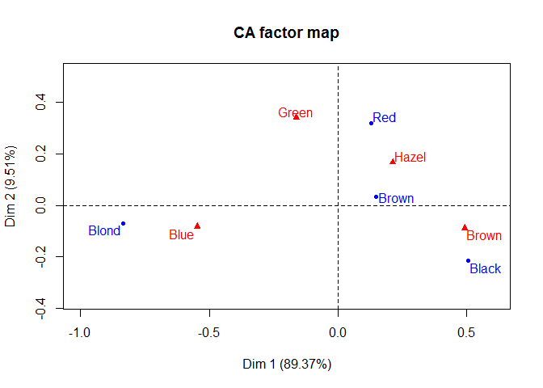

Correspondence Analysis
================
Anthony Contoleon
10 December 2016

Correspondence Analysis
=======================

Process and output
------------------

Producing a workflow in R to match most of the relevant output produced by SPSS.

Model Statistics
----------------

Initial check for relationships between the variables analysised for this model.

    ## 
    ##  Pearson's Chi-squared test
    ## 
    ## data:  wip.dt[, c(2:3)]
    ## X-squared = 109, df = 3, p-value < 2.2e-16

### Table of Frequencies.

    ##       Brown Blue
    ## Black    68   20
    ## Brown   119   84
    ## Red      26   17
    ## Blond     7   94

### Table of Residuals

    ##            Brown       Blue
    ## Black  3.5217100 -3.5624248
    ## Brown  1.6119817 -1.6306179
    ## Red    0.9119721 -0.9225154
    ## Blond -6.1676357  6.2389403

### Table of Adjusted Residuals

    ##            Brown      Blue
    ## Black   5.608657 -5.608657
    ## Brown   3.139685 -3.139685
    ## Red     1.366497 -1.366497
    ## Blond -10.011877 10.011877

Correspondence Analysis Output and Plots
----------------------------------------

### Total Inertia Value

    ## X-squared 
    ## 0.1841175

### Symetric Plot

### Model Sumary

    ## 
    ## Call:
    ## CA(X = wip.dt[, c(2:5)], ncp = 2, graph = FALSE) 
    ## 
    ## The chi square of independence between the two variables is equal to 138.2898 (p-value =  2.325287e-25 ).
    ## 
    ## Eigenvalues
    ##                        Dim.1   Dim.2   Dim.3
    ## Variance               0.209   0.022   0.003
    ## % of var.             89.373   9.515   1.112
    ## Cumulative % of var.  89.373  98.888 100.000
    ## 
    ## Rows
    ##         Iner*1000     Dim.1     ctr    cos2     Dim.2     ctr    cos2  
    ## Black |    55.425 |   0.505  22.246   0.838 |  -0.215  37.877   0.152 |
    ## Brown |    12.284 |   0.148   5.086   0.864 |   0.033   2.319   0.042 |
    ## Red   |    15.095 |   0.130   0.964   0.133 |   0.320  55.131   0.812 |
    ## Blond |   150.793 |  -0.835  71.704   0.993 |  -0.070   4.673   0.007 |
    ## 
    ## Columns
    ##         Iner*1000     Dim.1     ctr    cos2     Dim.2     ctr    cos2  
    ## Brown |    93.086 |   0.492  43.116   0.967 |  -0.088  13.042   0.031 |
    ## Blue  |   111.337 |  -0.547  52.128   0.977 |  -0.083  11.244   0.022 |
    ## Hazel |    13.089 |   0.213   3.401   0.542 |   0.167  19.804   0.336 |
    ## Green |    16.085 |  -0.162   1.355   0.176 |   0.339  55.910   0.773 |

### Row and Column Inerita and Mass

Summaries for row and column mass and interia values and percentage constribution to each dimension by each value.

    ##       Row Group    Inertia      Mass      Dim 1     Dim 2
    ## Black     Black 0.05542522 0.1824324 22.2463241 37.877386
    ## Brown     Brown 0.01228438 0.4831081  5.0859953  2.319381
    ## Red         Red 0.01509489 0.1199324  0.9637371 55.130519
    ## Blond     Blond 0.15079321 0.2145270 71.7039435  4.672715

    ##       Col Group    Inertia      Mass     Dim 1    Dim 2
    ## Brown     Brown 0.09308635 0.3716216 43.115744 13.04249
    ## Blue       Blue 0.11133715 0.3631757 52.128445 11.24401
    ## Hazel     Hazel 0.01308930 0.1570946  3.400961 19.80398
    ## Green     Green 0.01608490 0.1081081  1.354851 55.90952
