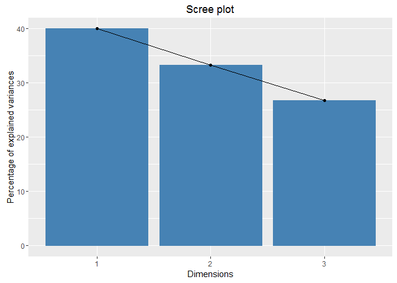
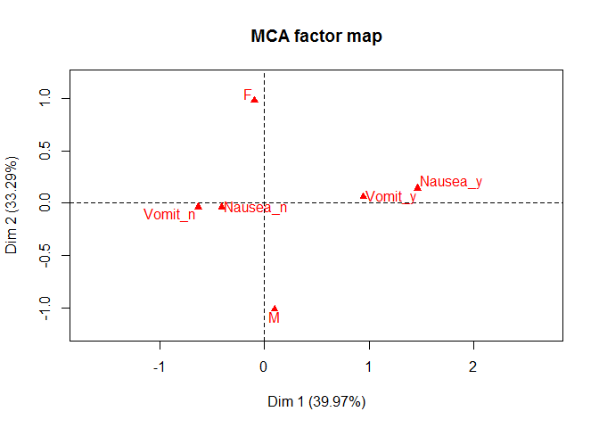
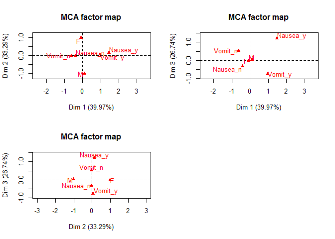
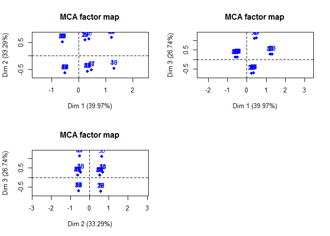

Multiple Correspondence Analysis
================
Anthony Contoleon
10 December 2016

Multiple Correspondence Analysis
================================

Process and output
------------------

### Screen plot for dimensions

### Symetric Plots

Plots of variables.

Plots of observations.

### Discriminant Measures

Contributions by variables to dimensions.

    ##                Dim 1       Dim 2        Dim 3
    ## Sex      0.008972332 0.990743850 0.0002838179
    ## Nausea   0.594146218 0.005536946 0.4003168360
    ## Vomiting 0.596076211 0.002287583 0.4016362061

### Eigen Values per Dimension

    ##       eigenvalue variance.percent cumulative.variance.percent
    ## Dim.1  0.3997316         39.97316                    39.97316
    ## Dim.2  0.3328561         33.28561                    73.25877
    ## Dim.3  0.2674123         26.74123                   100.00000

### Contribution Per Value

Contributions by variable values to dimensions.

    ##               Dim 1       Dim 2       Dim 3
    ## F         0.3672964 48.70624514  0.01736754
    ## M         0.3809000 50.51018015  0.01801078
    ## Nausea_n 10.8099123  0.12097930 10.88729021
    ## Nausea_y 38.7355191  0.43350914 39.01278992
    ## Vomit_n  19.8825489  0.09163451 20.02581662
    ## Vomit_y  29.8238233  0.13745176 30.03872493

### Full Model Summary

    ## 
    ## Call:
    ## MCA(X = wipMCA.df, ncp = 3, graph = FALSE) 
    ## 
    ## 
    ## Eigenvalues
    ##                        Dim.1   Dim.2   Dim.3
    ## Variance               0.400   0.333   0.267
    ## % of var.             39.973  33.286  26.741
    ## Cumulative % of var.  39.973  73.259 100.000
    ## 
    ## Individuals (the 10 first)
    ##             Dim.1    ctr   cos2    Dim.2    ctr   cos2    Dim.3    ctr
    ## 1        |  0.388  0.684  0.087 |  0.624  2.124  0.224 |  1.095  8.151
    ## 2        | -0.596  1.616  0.558 |  0.519  1.474  0.424 |  0.107  0.078
    ## 3        |  0.235  0.251  0.060 |  0.576  1.811  0.363 | -0.726  3.588
    ## 4        | -0.596  1.616  0.558 |  0.519  1.474  0.424 |  0.107  0.078
    ## 5        |  0.335  0.510  0.119 | -0.575  1.803  0.352 | -0.705  3.377
    ## 6        | -0.496  1.120  0.373 | -0.631  2.174  0.602 |  0.129  0.113
    ## 7        |  0.235  0.251  0.060 |  0.576  1.811  0.363 | -0.726  3.588
    ## 8        |  1.219  6.756  0.737 |  0.680  2.525  0.229 |  0.261  0.463
    ## 9        |  0.488  1.082  0.135 | -0.527  1.516  0.157 |  1.117  8.478
    ## 10       |  0.335  0.510  0.119 | -0.575  1.803  0.352 | -0.705  3.377
    ##            cos2  
    ## 1         0.690 |
    ## 2         0.018 |
    ## 3         0.577 |
    ## 4         0.018 |
    ## 5         0.529 |
    ## 6         0.025 |
    ## 7         0.577 |
    ## 8         0.034 |
    ## 9         0.708 |
    ## 10        0.529 |
    ## 
    ## Categories
    ##             Dim.1    ctr   cos2 v.test    Dim.2    ctr   cos2 v.test  
    ## F        | -0.093  0.367  0.009 -0.696 |  0.977 48.706  0.991  7.314 |
    ## M        |  0.096  0.381  0.009  0.696 | -1.014 50.510  0.991 -7.314 |
    ## Nausea_n | -0.407 10.810  0.594 -5.664 | -0.039  0.121  0.006 -0.547 |
    ## Nausea_y |  1.459 38.736  0.594  5.664 |  0.141  0.434  0.006  0.547 |
    ## Vomit_n  | -0.630 19.883  0.596 -5.673 | -0.039  0.092  0.002 -0.351 |
    ## Vomit_y  |  0.946 29.824  0.596  5.673 |  0.059  0.137  0.002  0.351 |
    ##           Dim.3    ctr   cos2 v.test  
    ## F        -0.017  0.017  0.000 -0.124 |
    ## M         0.017  0.018  0.000  0.124 |
    ## Nausea_n -0.334 10.887  0.400 -4.649 |
    ## Nausea_y  1.198 39.013  0.400  4.649 |
    ## Vomit_n   0.517 20.026  0.402  4.657 |
    ## Vomit_y  -0.776 30.039  0.402 -4.657 |
    ## 
    ## Categorical variables (eta2)
    ##            Dim.1 Dim.2 Dim.3  
    ## Sex      | 0.009 0.991 0.000 |
    ## Nausea   | 0.594 0.006 0.400 |
    ## Vomiting | 0.596 0.002 0.402 |

### Contribution Per Observation

Contributions by observation to dimensions.

    ##        Dim 1    Dim 2      Dim 3
    ## 1  0.6843534 2.123783 8.15108939
    ## 2  1.6161147 1.473884 0.07847747
    ## 3  0.2507784 1.811363 3.58798860
    ## 4  1.6161147 1.473884 0.07847747
    ## 5  0.5095514 1.802879 3.37661491
    ## 6  1.1198171 2.174286 0.11342090
    ## 7  0.2507784 1.811363 3.58798860
    ## 8  6.7563573 2.525408 0.46331751
    ## 9  1.0822397 1.516006 8.47772417
    ## 10 0.5095514 1.802879 3.37661491
    ## 11 6.7563573 2.525408 0.46331751
    ## 12 0.2507784 1.811363 3.58798860
    ## 13 1.6161147 1.473884 0.07847747
    ## 14 1.6161147 1.473884 0.07847747
    ## 15 1.1198171 2.174286 0.11342090
    ## 16 0.2507784 1.811363 3.58798860
    ## 17 0.5095514 1.802879 3.37661491
    ## 18 7.9093141 1.208744 0.54363518
    ## 19 0.2507784 1.811363 3.58798860
    ## 20 1.6161147 1.473884 0.07847747
    ## 21 1.1198171 2.174286 0.11342090
    ## 22 1.6161147 1.473884 0.07847747
    ## 23 0.2507784 1.811363 3.58798860
    ## 24 0.5095514 1.802879 3.37661491
    ## 25 1.6161147 1.473884 0.07847747
    ## 26 1.1198171 2.174286 0.11342090
    ## 27 0.2507784 1.811363 3.58798860
    ## 28 0.5095514 1.802879 3.37661491
    ## 29 1.6161147 1.473884 0.07847747
    ## 30 6.7563573 2.525408 0.46331751
    ## 31 1.6161147 1.473884 0.07847747
    ## 32 1.1198171 2.174286 0.11342090
    ## 33 1.6161147 1.473884 0.07847747
    ## 34 1.1198171 2.174286 0.11342090
    ## 35 0.6843534 2.123783 8.15108939
    ## 36 7.9093141 1.208744 0.54363518
    ## 37 1.0822397 1.516006 8.47772417
    ## 38 1.6161147 1.473884 0.07847747
    ## 39 1.1198171 2.174286 0.11342090
    ## 40 7.9093141 1.208744 0.54363518
    ## 41 1.0822397 1.516006 8.47772417
    ## 42 1.1198171 2.174286 0.11342090
    ## 43 1.6161147 1.473884 0.07847747
    ## 44 6.7563573 2.525408 0.46331751
    ## 45 0.5095514 1.802879 3.37661491
    ## 46 1.1198171 2.174286 0.11342090
    ## 47 1.1198171 2.174286 0.11342090
    ## 48 1.1198171 2.174286 0.11342090
    ## 49 1.6161147 1.473884 0.07847747
    ## 50 1.6161147 1.473884 0.07847747
    ## 51 1.1198171 2.174286 0.11342090
    ## 52 1.1198171 2.174286 0.11342090
    ## 53 1.6161147 1.473884 0.07847747
    ## 54 0.5095514 1.802879 3.37661491
    ## 55 0.5095514 1.802879 3.37661491
